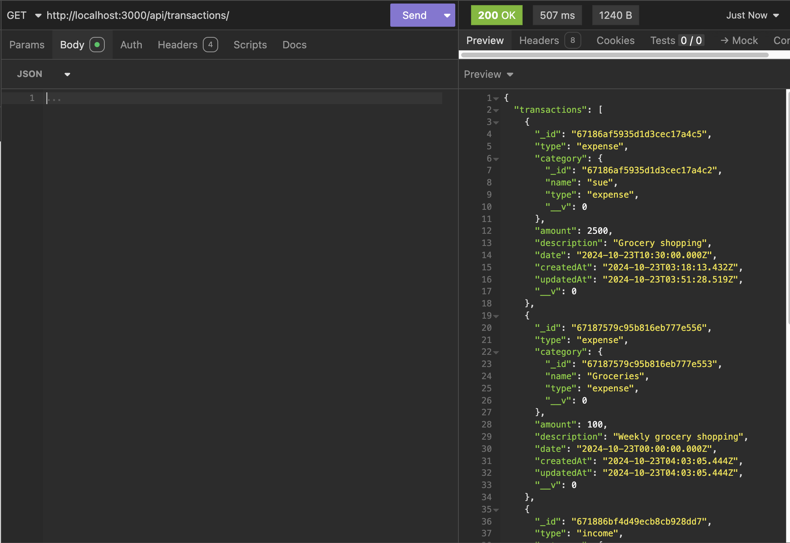

# Floww.AI Transaction Management System

A RESTful API for managing financial transactions and categories, built with Node.js, Express, and MongoDB.

## Table of Contents

- [Quick Start](#quick-start)
- [Setup Guide](#setup-guide)
- [API Documentation](#api-documentation)
- [Development](#development)

## Quick Start

```bash
# Clone and install
git clone <repository-url>
cd flowai-assignment
npm install

# Configure
cp .env.example .env
# Edit .env with your MongoDB URI

# Run
npm start
```

## Setup Guide

### Prerequisites

- Node.js (v14+)
- npm
- MongoDB

### Environment Configuration

```env
PORT=3000
MONGODB_URI=mongodb://localhost:27017/flowai
```

## API Documentation

### Base URL

```
http://localhost:3000/api
```

### Transactions API (`/transactions`)

#### 1. List Transactions

```http
GET /api/transactions
```

```bash
curl http://localhost:3000/api/transactions
```

#### 2. Create Transaction

```http
POST /api/transactions
Content-Type: application/json

{
  "type": "income",
  "amount": 1000,
  "description": "Monthly salary",
  "category": {
    "name": "Salary",
    "type": "income"
  }
}
```

```bash
curl -X POST http://localhost:3000/api/transactions \
  -H "Content-Type: application/json" \
  -d '{"type":"income","amount":1000,"description":"Monthly salary","category":{"name":"Salary","type":"regular"}}'
```

#### 3. Get Transaction

```http
GET /api/transactions/:id
```

```bash
 http://localhost:3000/api/transactions/123456789
```

#### 4. Update Transaction

```http
PUT /api/transactions/:id
Content-Type: application/json

{
  "amount": 1500,
  "description": "Updated salary"
}
```

```bash
curl -X PUT http://localhost:3000/api/transactions/123456789 \
  -H "Content-Type: application/json" \
  -d '{"amount":1500,"description":"Updated salary"}'
```

#### 5. Delete Transaction

```http
DELETE /api/transactions/:id
```

```bash
http://localhost:3000/api/transactions/123456789
```

#### 6. Get Summary

```http
GET /api/transactions/summary/all?startDate=2024-01-01&endDate=2024-12-31
```

```bash
curl "http://localhost:3000/api/transactions/summary/all?startDate=2024-01-01&endDate=2024-12-31"
```

### Categories API (`/categories`)

#### 1. List Categories

```http
GET /api/categories
```

```bash
curl http://localhost:3000/api/categories
```

#### 2. Create Category

```http
POST /api/categories
Content-Type: application/json

{
  "name": "Groceries",
  "type": "expense"
}
```

```bash
curl -X POST http://localhost:3000/api/categories \
  -H "Content-Type: application/json" \
  -d '{"name":"Groceries","type":"expense"}'
```

### Response Formats

#### Transaction Object

```json
{
  "_id": "607f1f77bcf86cd799439011",
  "type": "income",
  "amount": 1000,
  "description": "Monthly salary",
  "category": {
    "_id": "607f1f77bcf86cd799439012",
    "name": "Salary",
    "type": "regular"
  },
  "date": "2024-03-01T00:00:00.000Z"
}
```

#### Summary Response

```json
{
  "totalIncome": 5000,
  "totalExpenses": 3000,
  "balance": 2000
}
```

### Error Codes

| Code | Description           | Example Response                            |
| ---- | --------------------- | ------------------------------------------- |
| 200  | Success               | `{ "message": "Success" }`                  |
| 201  | Created               | `{ "createdTransaction": {...} }`           |
| 400  | Bad Request           | `{ "message": "Invalid transaction type" }` |
| 404  | Not Found             | `{ "message": "Transaction not found" }`    |
| 500  | Internal Server Error | `{ "error": "Database connection failed" }` |

## Development

### Project Structure

```
flowai-assignment/
├── index.js              # Entry point
├── routes/              # API routes
├── models/              # Data models
├── controllers/         # Business logic
├── middlewares/        # Custom middlewares
├── tests/              # Test files
└── .env                # Environment config
```

### Key Dependencies

- express (^4.21.1): Web framework
- mongoose (^8.7.2): MongoDB ODM
- cors (^2.8.5): CORS middleware
- dotenv (^16.4.5): Environment management

### Scripts

```bash
# Start server
npm start

# Run tests
npm test

# Development mode
npm run dev
```

### Data Validation Rules

- Transaction types: Must be "income" or "expense"
- Amounts: Positive numbers only
- Dates: ISO 8601 format
- Descriptions: Max 500 characters

### Best Practices

1. Always use proper HTTP methods
2. Include error handling in requests
3. Validate input data
4. Use meaningful status codes
5. Keep responses consistent

### Contributing

1. Fork the repository
2. Create a feature branch
3. Commit changes
4. Push to the branch
5. Create a Pull Request

### License

ISC


### ScreenShots of OutPut



